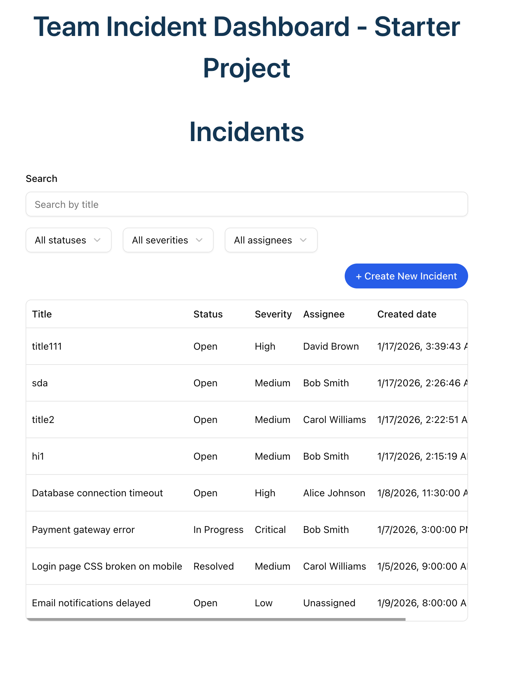
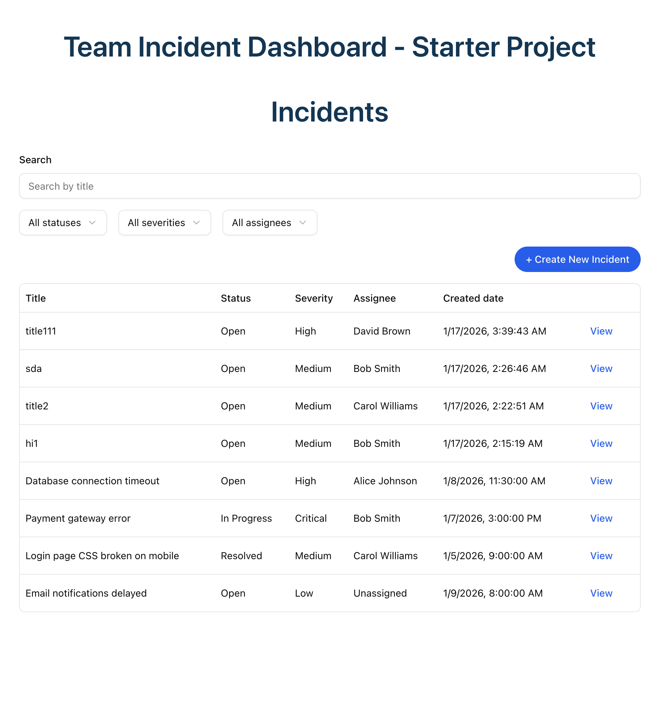
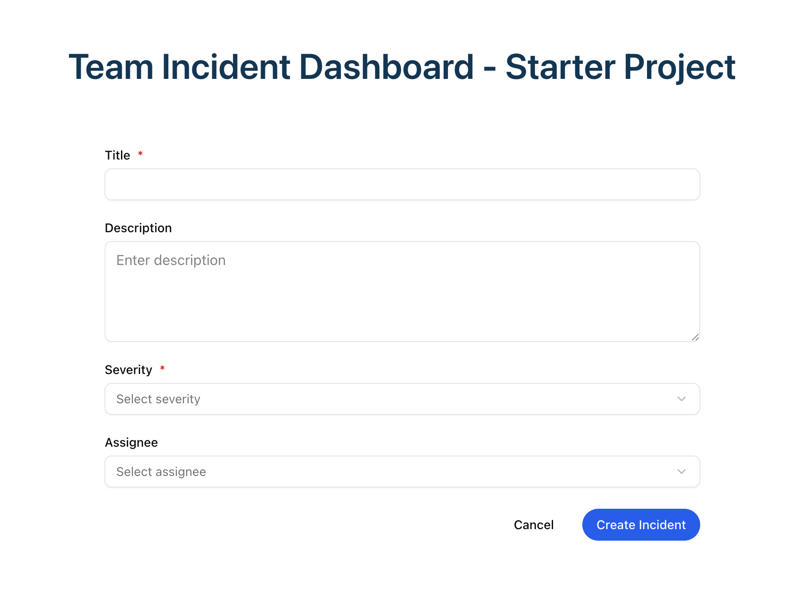

# Team Incident Dashboard - Starter Project

Display a list of incidents and allow users to filter by title, status, severity, and assignee
<br>
The list of incidents allows users to view incident details and create a new incident

## Feedback
Managed to resolve some of the tasks. not all of them, since it was recommended to use a maximum of 4 hours of focused work.
It was simple, with not much logic required, and the styles were done using shadcn and Tailwind.

It was fun, though. I went back and rethought my approach, deciding to use TanStack Form instead of React Hook Form (I felt it was a good chance to try it out 🙂)

## Architecture & key decisions
- <b>No global state library</b>: Minimal data sharing, so a global state library was unnecessary and would add complexity.

- <b>Data fetching strategy</b>: I chose React Query (@tanstack) because it separates server state from client state and handles loading, status, and errors (out of the box).

    When the API or contracts cannot be modified to aggregate responses, for example, when incidents include an assigneeId that points to a user fetched from another request. Tanstack Query  caching allows the Incidents to display assignee user immediately.

- <b>For local UI state (forms, filters) </b>: For forms (IncidentCreate), I used TanStack Form, zod schema( handles validation, touched/dirty states and, since the project already uses TanStack Query, decided to keep the stack consistency).
For filters (IncidentOverview), I use React’s useState because filter state is usually simple

- <b>File folder structure </b>: Feature/Modular approach that separate business features, API, and other layers like UI, utilities


```bash
src/o
├── api/                           # Mocked API
├── lib/                           # Utilities, all technicalities unrelated to business logic
├── core/                          # API, Expose all API(mocked endpoints) methods
    ├── api/                       # API, Expose all API methods
    ├── router/                    # Routes for Lazy load Components
├── common/                        # Shared or common code
    ├── ui/                        # All common UI components and external (shadecn) components   
    ├── models/                    # Business related domains/models 

├── features/                      # All business features 
    ├── Incidents
        ├── IncidentsOverview/     # Display Incidents, filter by, create and  view incident
        ├── IncidentCreate/        # Create Incident, Form, 
        ├── IncidentDetails/       # Display Incident Details         

```

## Trade-offs & limitations: 
  - <b>No interactive sorting </b>: Not implemented, as it was optional. I decided to skip it to focused on core functionality
  - <b>Incidents editing</b>: Not implemented. I focused on creating and viewing incidents to cover the main flow, leaving updates for future improvements.

## Use of tooling/AI
I used TanStack Form because I wanted to experiment with it (since I am already using Tanstack Query). Although I could have used the more common `react-hook-form`, I wanted to step out of my comfort zone.

Some of the suggestions here were assisted by Copilot, but I only used them carefully and when I already know the approach. I avoid blindly accepting generated code

## Screenshots
- Incidents Overview
    - Tablet: 
   
    - Desktop:
   

- Incident Create Form


## Getting Started

### Prerequisites

- Node.js 18+
- npm or yarn

### Installation

```bash
npm install
```

### Development

```bash
npm run dev
```

Opens the app at [http://localhost:5173](http://localhost:5173)

### Testing

```bash
npm test
```

### Build

```bash
npm run build
```

## Stack

- **React 18** - UI library
- **TypeScript** - Type safety
- **Vite** - Build tool
- **Vitest** - Testing
- **React Testing Library** - Component testing
